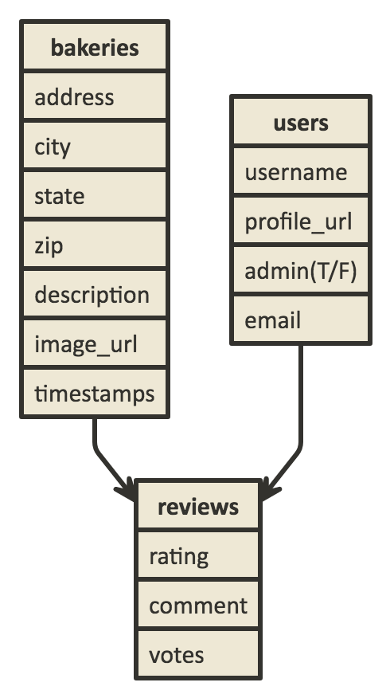

# README

<h1>Donut Worry</h1>
<h2>A review site for those who go nuts for donuts</h2>
<h5>Contributors</h5>
<ul>
  <li><a href="https://github.com/PatrickDennisFarley">Patrick Farley</a></li>
  <li><a href="https://github.com/laurado">Laura Do</a></li>
  <li><a href="https://github.com/cserafino66">Colin Serafino</a></li>
  <li><a href="https://github.com/jessicatitus">Jessica Titus</a></li>
</ul>

<h5>Introduction</h5>

Donut Worry is Launch Academy's premier destination for sharing and reviewing breakfast confectionaries of all shapes and sizes.

<h5>Features</h5>
<ul>
<li>Users can create and update their own personal account.</li>
<li>Users can sign in/out of their account</li>
<li>Users can optionally add a profile picture to their account.</li>
<li>Users can add a bakery to the list displayed on the root page.</li>
<li>Users can optionally add an image to the bakery listings.</li>
<li>Users can add reviews on individual bakery pages.</li>
<li>Users can edit reviews they have created.</li>
<li>Users can upvote or downvote individual reviews based on helpfulness.</li>
<li>Users are notified via email of any upvote/downvote activity on reviews they have posted.</li>
<li>Admins can delete any review.</li>
</ul>

<h5>Technologies</h5>
<ul>
<li>Backend: Rails 5.1.2</li>
<li>Frontend: React.js and Embedded Ruby</li>
<li>User Auth: Devise</li>
<li>Image Uploader: CarrierWave</li>
<li>Image Hosting: Amazon Web Services</li>
<li>Styling: Foundation</li>
<li>Database: Postgres</li>
<li>Testing: RSpec, Capybara, Jasmine, Karma, Enzyme</li>
</ul>

<h5>To run this app on your local machine</h5>
<ul>
<li>Install Ruby.2.3.3</li>
<li>In a terminal, run `git clone https://github.com/laurado/donut-worry.git`</li>
<li>Navigate to the project's root directory with `cd donut-worry`</li>
<li>Run `bundle install && npm install && rake db:setup`</li>
<li>In terminal, run `rails s`</li>
<li>In another terminal window, run  `npm start`</li>
<li>Visit <a href='http://localhost:3000/'>http://localhost:3000/</a> in your browser.</li>
</ul>

 
